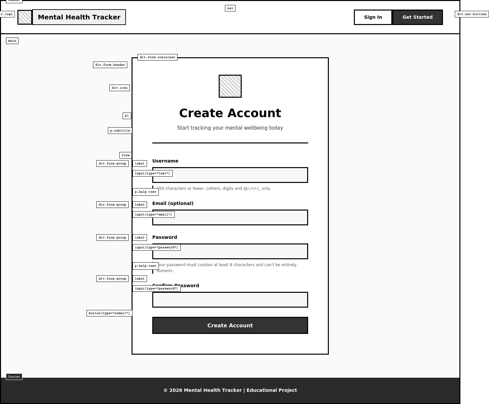

# Mental Health Tracker

A full-stack web application built with Django that helps users track their daily mood, visualise emotional trends over time, and access curated mental health resources. Designed as a personal wellness tool with full CRUD functionality and user authentication.

**Live site:** *Deployment in progress*

---

## Table of Contents

- [Project Rationale](#project-rationale)
- [User Stories](#user-stories)
- [Wireframes](#wireframes)
- [Data Model](#data-model)
- [Features](#features)
- [Technologies Used](#technologies-used)
- [Testing](#testing)
- [Deployment](#deployment)
- [Security](#security)
- [Credits](#credits)

---

## Project Rationale

Mental health awareness is growing, but many people still lack a simple, private way to track how they feel day to day. This application was built to fill that gap by providing a straightforward mood tracker that anyone can use.

The core idea is simple: log your mood on a scale of 0–10 each day, add optional notes about what influenced it, and review your trends over the past week through a line chart. The app also offers a curated resource library covering ADHD, depression, anxiety, and general mental health topics.

This project was built as Portfolio Project 4 for the Code Institute Full-Stack Software Development programme, demonstrating Django, PostgreSQL, CRUD operations, user authentication, and responsive front-end design.

### Target Audience

- People who want a quick, private way to log daily moods
- Users looking for a visual overview of their emotional patterns
- Anyone seeking curated mental health resources in one place

---

## User Stories

| # | As a... | I want to... | So that... | Implemented |
|---|---------|-------------|------------|:-----------:|
| 1 | visitor | view the home page | I can understand what the app does | Yes |
| 2 | visitor | register an account | I can start tracking my mood | Yes |
| 3 | visitor | read the privacy policy | I know how my data is handled | Yes |
| 4 | user | log in and log out | my data stays private | Yes |
| 5 | user | create a mood entry | I can record how I feel today | Yes |
| 6 | user | view my mood history | I can see all my past entries | Yes |
| 7 | user | edit a mood entry | I can correct mistakes | Yes |
| 8 | user | delete a mood entry | I can remove entries I no longer want | Yes |
| 9 | user | see a weekly mood chart | I can spot trends in my wellbeing | Yes |
| 10 | user | browse mental health resources | I can find helpful articles and links | Yes |
| 11 | user | only see my own data | my entries are private from other users | Yes |

---

## Wireframes

Wireframes were created during the planning phase to guide the layout and user flow.



---

## Data Model

The application uses two main models backed by PostgreSQL (production) or SQLite (development).

### Entity Relationship Diagram

```
┌──────────────────┐       ┌──────────────────────┐
│   User (Django)  │       │     MoodEntry         │
├──────────────────┤       ├──────────────────────-┤
│ id (PK)          │──┐    │ id (PK)               │
│ username         │  │    │ user (FK → User)      │
│ email            │  └───>│ date                  │
│ password         │       │ mood_score (0-10)     │
│                  │       │ notes (max 500 chars) │
│                  │       │ created_at            │
│                  │       │ updated_at            │
└──────────────────┘       └──────────────────────-┘

┌──────────────────────┐
│     Resource          │
├──────────────────────-┤
│ id (PK)               │
│ title                 │
│ description           │
│ link (URL)            │
│ category (ADHD /      │
│   Depression /        │
│   Anxiety / General)  │
│ created_at            │
│ updated_at            │
└──────────────────────-┘
```

**Relationships:**
- Each `User` can have many `MoodEntry` records (one-to-many).
- `Resource` is a standalone model managed through the Django admin panel.
- When a `User` is deleted, all associated `MoodEntry` records are also deleted (`CASCADE`).

---

## Features

### Home Page
- Welcome message explaining the app's purpose
- Three feature cards linking to mood tracking, daily journaling, and privacy info
- Responsive layout using Bootstrap 5 grid

### User Authentication
- Custom registration form with email, username, and password
- Django's built-in authentication for login/logout
- Success messages on registration, login, and logout
- `@login_required` decorator protects all mood and resource pages

### Mood Tracking (Full CRUD)
- **Create**: Log a mood score (0–10) using a colour-changing slider and optional notes with a character counter
- **Read**: View all past entries in a paginated list (10 per page)
- **Update**: Edit any of your own entries
- **Delete**: Remove entries with a confirmation page before deletion
- Users can only access their own entries — attempting to view, edit, or delete another user's entry returns a 404

### Mood Trends
- Weekly line chart built with Chart.js showing average daily mood scores
- Summary statistics: weekly average, highest score, lowest score
- Chart loads asynchronously from CDN and handles load failures gracefully

### Resource Library
- Curated links grouped into four categories: ADHD, Depression, Anxiety, General
- Resources are managed through the Django admin panel
- Each resource has a title, description, and external link

### Privacy Page
- Accessible to all visitors (no login required)
- Explains data handling and user rights

### Responsive Design
- Fully responsive across mobile (375px), tablet (768px), and desktop (1200px+)
- Bootstrap 5 grid with collapsible navbar on smaller screens
- Hover effects on cards and buttons using vanilla JavaScript

---

## Technologies Used

### Languages
- Python 3.14
- HTML5
- CSS3
- JavaScript (ES6)

### Frameworks and Libraries
- **Django 6.0.1** — web framework
- **Bootstrap 5** — responsive UI components
- **Chart.js** — mood trends line chart
- **Font Awesome** — icons
- **WhiteNoise** — static file serving in production
- **Gunicorn** — WSGI HTTP server for production
- **dj-database-url** — database configuration from environment variable
- **python-decouple** — environment variable management
- **Pillow** — image processing
- **psycopg2** — PostgreSQL adapter

### Tools
- **Git** — version control
- **GitHub** — repository hosting
- **Heroku** — cloud deployment
- **JSHint** — JavaScript validation
- **W3C Validator** — HTML and CSS validation

---

## Testing

Full testing documentation is available in [docs/TESTING.md](docs/TESTING.md).

### Summary

- **46 automated Python tests** covering models, forms, views, and a full user-flow integration test
- **19 manual JavaScript tests** covering hover effects, slider behaviour, character counter, Chart.js rendering, and responsiveness
- **Validation**: HTML (W3C), CSS (W3C), JavaScript (JSHint) — all passing

### Test Files

| File | Tests | Coverage |
|------|:-----:|----------|
| `tracker/test_models.py` | 5 | MoodEntry and Resource model behaviour |
| `tracker/test_forms.py` | 8 | RegisterForm and MoodEntryForm validation |
| `tracker/test_views.py` | 32 | All views: auth, CRUD, permissions, pagination, 404s |
| `tracker/tests_user_flow.py` | 1 | Full user journey: login → create → view → edit → delete |

### Running Tests

```bash
python manage.py test tracker -v 2
```

---

## Deployment

The application is deployed on **Heroku** using a PostgreSQL database.

### Prerequisites

- A [Heroku](https://heroku.com) account
- [Heroku CLI](https://devcenter.heroku.com/articles/heroku-cli) installed
- A GitHub repository with the project code

### Steps

1. **Create a Heroku app**
   ```bash
   heroku create your-app-name
   ```

2. **Add PostgreSQL**
   ```bash
   heroku addons:create heroku-postgresql:essential-0
   ```

3. **Set environment variables**
   ```bash
   heroku config:set SECRET_KEY="your-secret-key"
   heroku config:set DEBUG=False
   heroku config:set ALLOWED_HOSTS="your-app-name.herokuapp.com"
   ```

4. **Deploy**
   ```bash
   git push heroku main
   ```

5. **Run migrations**
   ```bash
   heroku run python manage.py migrate
   ```

6. **Create a superuser** (for admin panel access)
   ```bash
   heroku run python manage.py createsuperuser
   ```

### Local Development

1. Clone the repository:
   ```bash
   git clone https://github.com/your-username/mental-health-tracker.git
   cd mental-health-tracker
   ```

2. Create and activate a virtual environment:
   ```bash
   python -m venv venv
   source venv/bin/activate
   ```

3. Install dependencies:
   ```bash
   pip install -r requirements.txt
   ```

4. Create a `.env` file in the project root:
   ```
   SECRET_KEY=your-secret-key-here
   DEBUG=True
   ALLOWED_HOSTS=localhost,127.0.0.1
   ```

5. Run migrations and start the server:
   ```bash
   python manage.py migrate
   python manage.py runserver
   ```

---

## Security

The application follows security best practices:

- **Secret key** is stored in environment variables, never committed to version control
- **DEBUG mode** is disabled in production
- **CSRF protection** is enabled on all forms via Django's middleware
- **User isolation**: mood entries are filtered by `user=request.user` and protected with `get_object_or_404` — users cannot access, edit, or delete other users' data
- **Password validation** uses Django's built-in validators (minimum length, common password check, numeric check, similarity check)
- **HTTPS** is enforced by Heroku in production
- **WhiteNoise** serves static files securely without needing a separate file server
- **Sensitive files** (`.env`, `db.sqlite3`) are excluded from version control via `.gitignore`

---

## Credits

### Content
- Mental health resources were curated from publicly available sources
- Privacy policy text was written for this project

### Technologies
- [Django Documentation](https://docs.djangoproject.com/)
- [Bootstrap 5 Documentation](https://getbootstrap.com/docs/)
- [Chart.js Documentation](https://www.chartjs.org/docs/)

### Acknowledgements
- Code Institute for the project framework and learning materials
- The Django and Bootstrap open-source communities
