# Mental Health Tracker

A full-stack web application built with Django that helps users track their daily mood, visualise emotional trends over time, and access curated mental health resources. Designed as a personal wellness tool with full CRUD functionality and user authentication.

**Live site:** [https://mental-health-tracker-cleino-e2c27d0f57d7.herokuapp.com/](https://mental-health-tracker-cleino-e2c27d0f57d7.herokuapp.com/)

**Test account:**
| Role | Username | Password |
|---|---|---|
| Regular user | testuser | TestPass123! |
| Admin | admin | AdminPass123! |

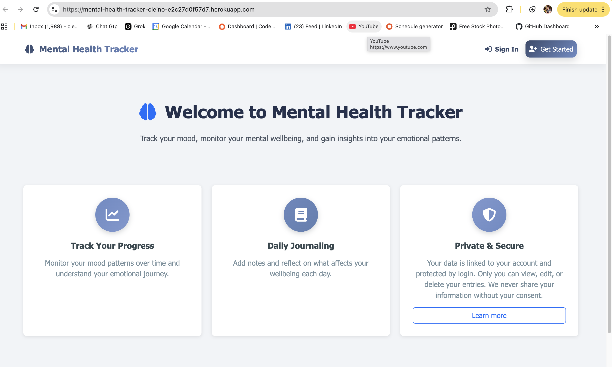

---

## Table of Contents

- [Project Rationale](#project-rationale)
- [Agile Methodology](#agile-methodology)
- [User Stories](#user-stories)
- [Design](#design)
- [Wireframes](#wireframes)
- [Data Model](#data-model)
- [Features](#features)
- [Future Features](#future-features)
- [Technologies Used](#technologies-used)
- [Testing](#testing)
- [Deployment](#deployment)
- [Security](#security)
- [Credits](#credits)

---

## Project Rationale

Mental health awareness is growing, but many people still lack a simple, private way to track how they feel day to day. This application was built to fill that gap by providing a straightforward mood tracker that anyone can use.

The core idea is simple: log your mood on a scale of 0-10 each day, add optional notes about what influenced it, and review your trends over the past week through a line chart. The app also offers a curated resource library covering ADHD, depression, anxiety, and general mental health topics.

This project was built as Portfolio Project 4 for the Code Institute Full-Stack Software Development programme, demonstrating Django, PostgreSQL, CRUD operations, user authentication, and responsive front-end design.

### Target Audience

- People who want a quick, private way to log daily moods
- Users looking for a visual overview of their emotional patterns
- Anyone seeking curated mental health resources in one place

---

## Agile Methodology

This project was developed using Agile principles. User stories were created as [GitHub Issues](https://github.com/oliveiracle/mental-health-tracker/issues?q=is%3Aissue+is%3Aclosed) and tracked through to completion.

Each user story included acceptance criteria and was moved through the workflow: **To Do → In Progress → Done**. Features were built incrementally, with regular commits reflecting each piece of functionality as it was completed.

User stories were prioritised using the **MoSCoW method**:
- **Must Have** — core features required for the app to function (#1 Authentication, #2 Create Entry, #3 View History, #4 Edit/Delete)
- **Should Have** — important but not critical (#5 Resource Library)
- **Could Have** — future enhancements (monthly trends, CSV export, email reminders)

The commit history shows a clear progression from initial setup through models, views, templates, testing, and final documentation.

---

## User Stories

| #                                                                   | User Story                                                                                 | Acceptance Criteria                                                                                | Status |
| ------------------------------------------------------------------- | ------------------------------------------------------------------------------------------ | -------------------------------------------------------------------------------------------------- | :----: |
| [#1](https://github.com/oliveiracle/mental-health-tracker/issues/1) | As a visitor, I want to register an account so that I can start tracking my mood           | User can register with username, email and password; is logged in automatically after registration |  Done  |
| [#2](https://github.com/oliveiracle/mental-health-tracker/issues/2) | As a user, I want to create a daily mood entry so that I can record how I feel             | User can log a mood score (0-10) with optional notes; entry is saved to their account              |  Done  |
| [#3](https://github.com/oliveiracle/mental-health-tracker/issues/3) | As a user, I want to view my mood history so that I can see all my past entries            | User sees a paginated list of their mood entries, newest first                                     |  Done  |
| [#4](https://github.com/oliveiracle/mental-health-tracker/issues/4) | As a user, I want to edit and delete mood entries so that I can correct or remove them     | User can update or delete their own entries; cannot access other users' data                       |  Done  |
| [#5](https://github.com/oliveiracle/mental-health-tracker/issues/5) | As a user, I want to access mental health resources so that I can find helpful information | User sees resources grouped by category (ADHD, Depression, Anxiety, General)                       |  Done  |

---

## Design

### Colour Scheme

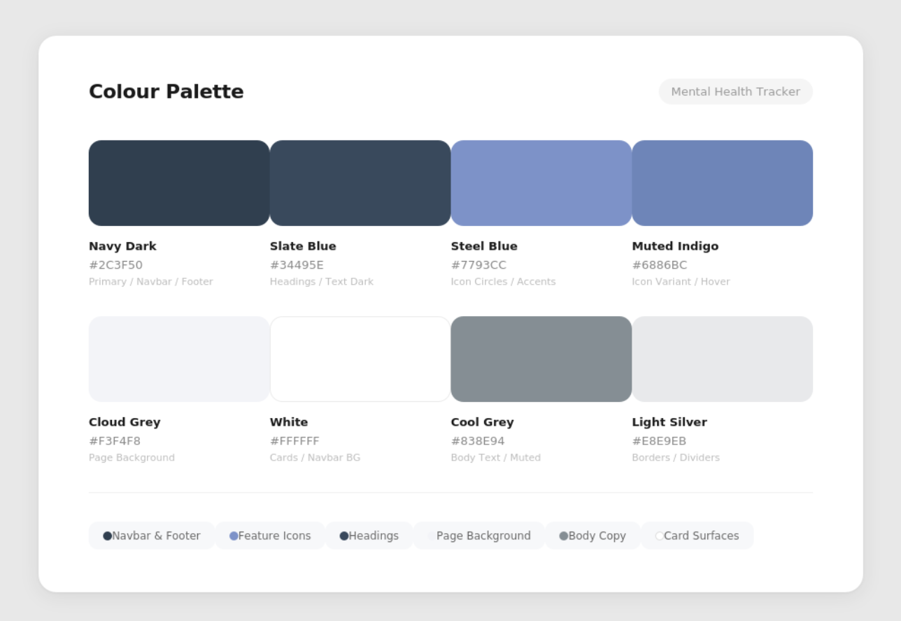

The colour palette was chosen deliberately to support the mental health context of the application:

- **Navy Dark** (`#2C3F50`) — Primary colour for navbar and footer. Dark blues convey trust, stability and professionalism, helping users feel secure when sharing personal data.
- **Slate Blue** (`#34495E`) — Used for headings and dark text. Provides strong readability while remaining softer than pure black, reducing visual strain.
- **Steel Blue** (`#7793CC`) — Icon circles and accent elements. Lighter blues are associated with calm and serenity, encouraging a relaxed user experience.
- **Muted Indigo** (`#6886BC`) — Hover states and icon variants. Adds subtle interactivity without overwhelming the user.
- **Cloud Grey** (`#F3F4F8`) — Page background. A near-white tone that feels clean and open, reducing cognitive load.
- **White** (`#FFFFFF`) — Card surfaces and navbar background. Creates clear visual separation between content sections.
- **Cool Grey** (`#838E94`) — Body text and muted elements. Softer than black for comfortable reading over longer sessions.
- **Light Silver** (`#E8E9EB`) — Borders and dividers. Provides structure without visual noise.
- **Mood slider**: Gradient from red (low mood) through yellow to green (high mood), giving instant emotional feedback through colour psychology.

### Typography

The application uses the system font stack:

```
-apple-system, BlinkMacSystemFont, 'Segoe UI', Roboto, sans-serif
```

This choice was intentional for several reasons:

- **Performance**: No external font files to download, resulting in zero render-blocking requests and faster page loads.
- **Familiarity**: Users see the native font of their operating system (San Francisco on macOS/iOS, Segoe UI on Windows, Roboto on Android), creating a sense of comfort and trust.
- **Readability**: System fonts are optimised by each OS for screen rendering, ensuring clear text at all sizes — important for a wellness application where users may be reading during difficult moments.
- **Accessibility**: System fonts respect user-configured font size and accessibility settings at the OS level.

### Design Decisions

- Minimal, distraction-free interface — the focus is on the user's data, not visual noise
- Card-based layout for the home page to clearly present the three core features
- Colour-changing mood slider provides instant visual feedback
- Confirmation step before deleting entries to prevent accidental data loss

---

## Wireframes

Wireframes were created during the planning phase to guide the layout and user flow.

### Desktop

| Page        | Wireframe                                                                   |
| ----------- | --------------------------------------------------------------------------- |
| Home        | 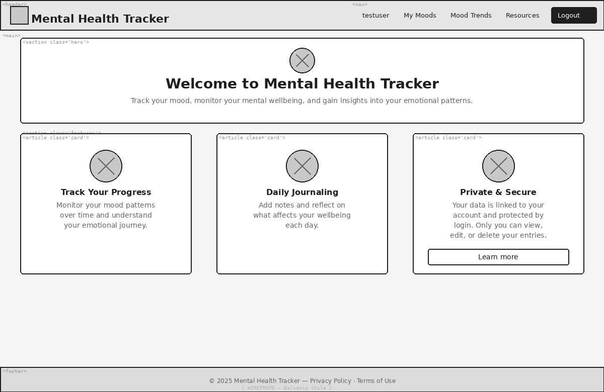      |
| Sign Up     | 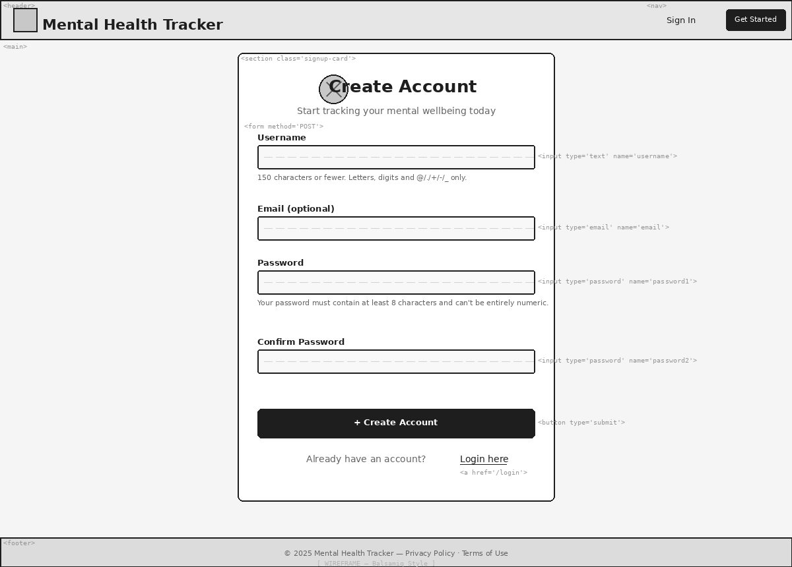          |
| Login       | 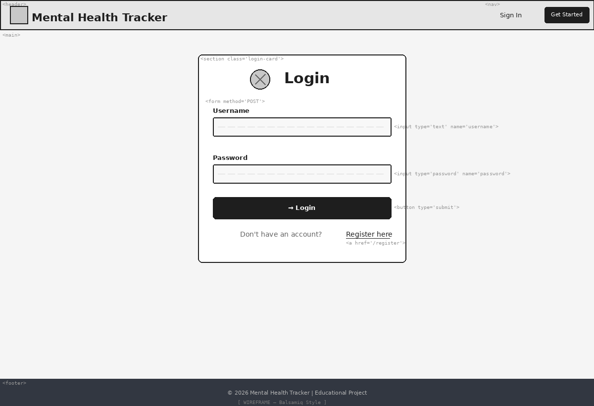             |
| Mood List   | 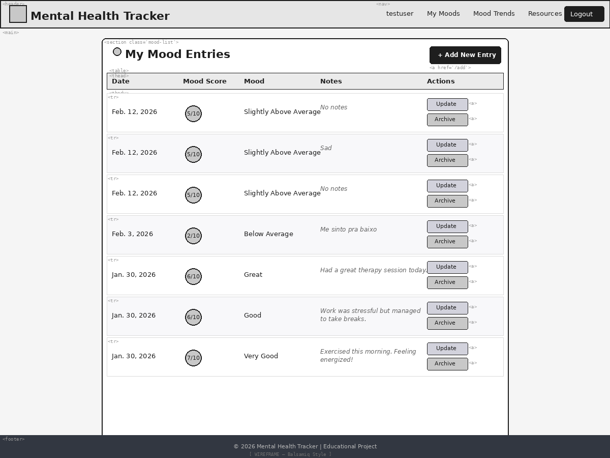         |
| Add Mood    | 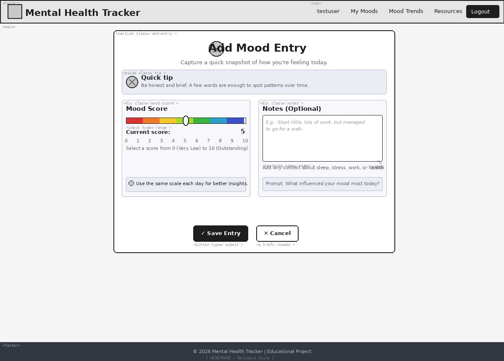       |
| Delete Mood | 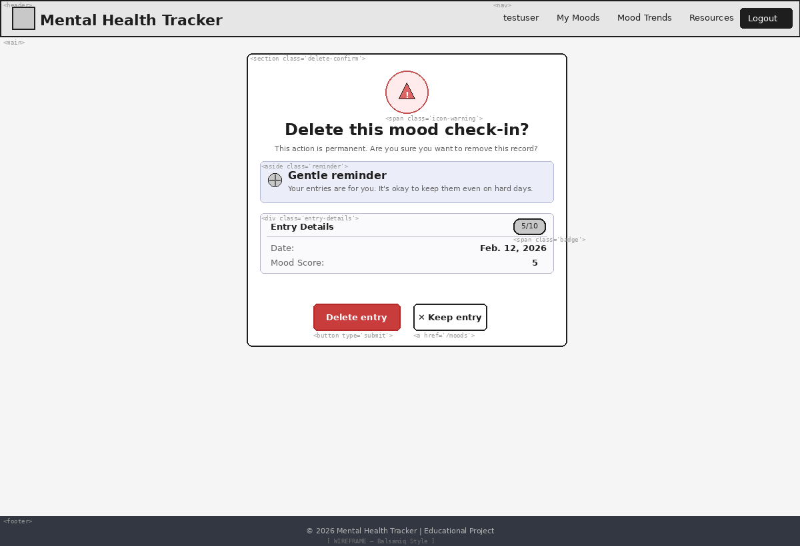 |
| Mood Trends | 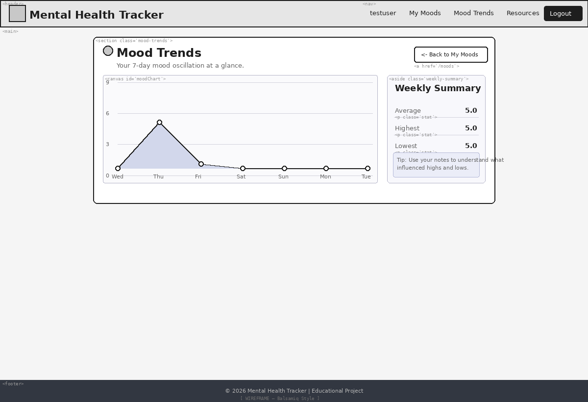      |
| Resources   | 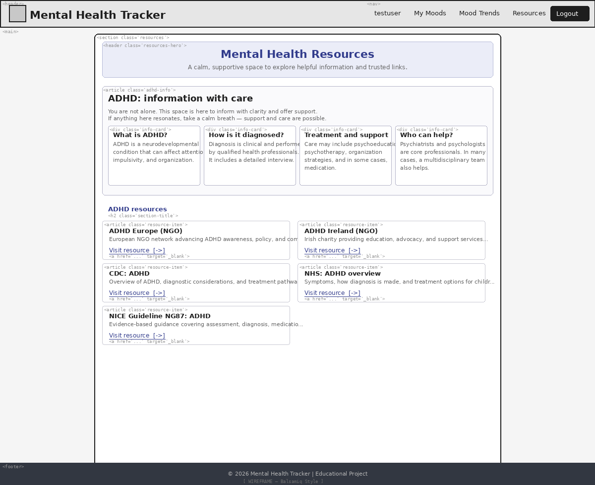     |

### Mobile

| Page        | Wireframe                                                                         |
| ----------- | --------------------------------------------------------------------------------- |
| Home        | 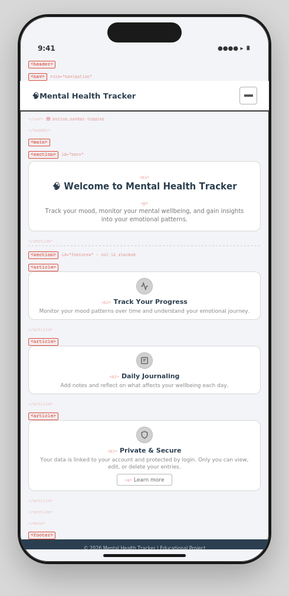           |
| Sign Up     | 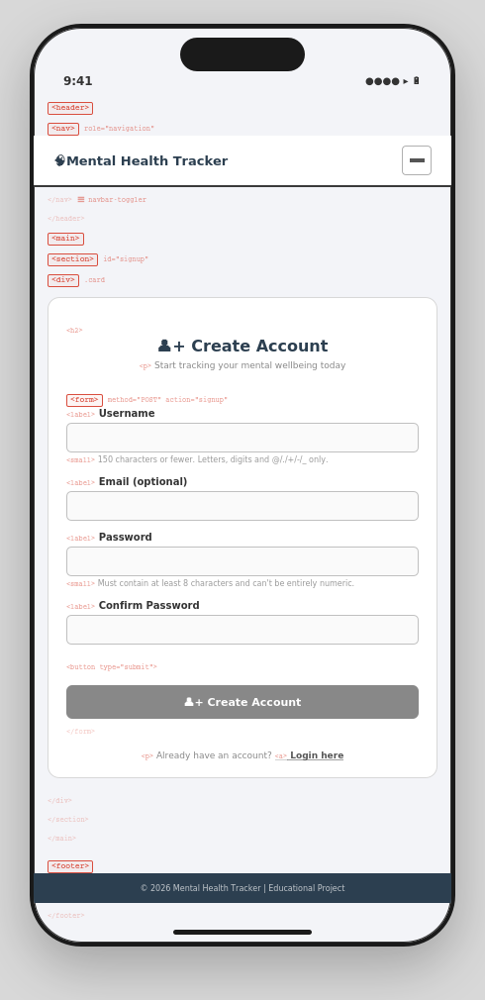          |
| Mood List   | 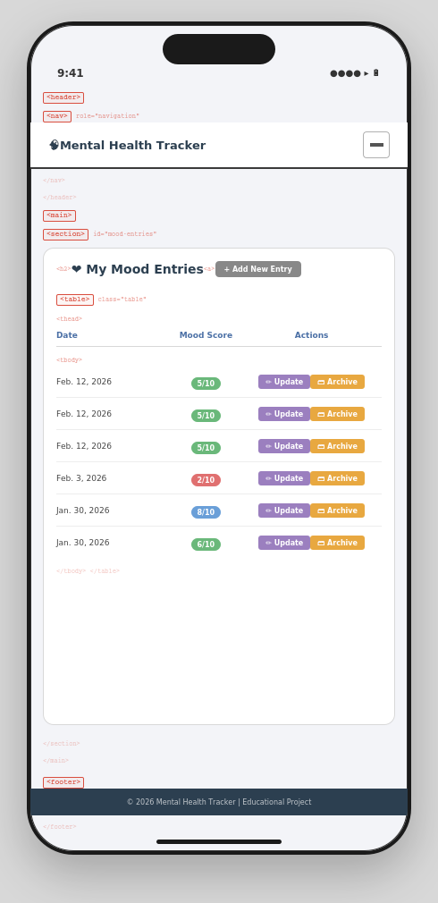  |
| Add Mood    | 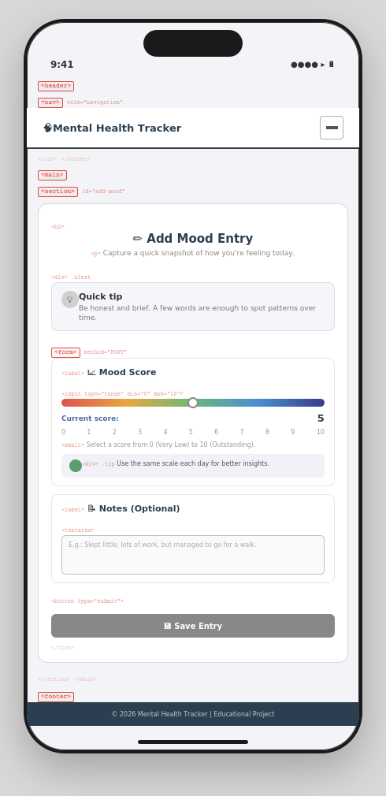 |
| Mood Trends | 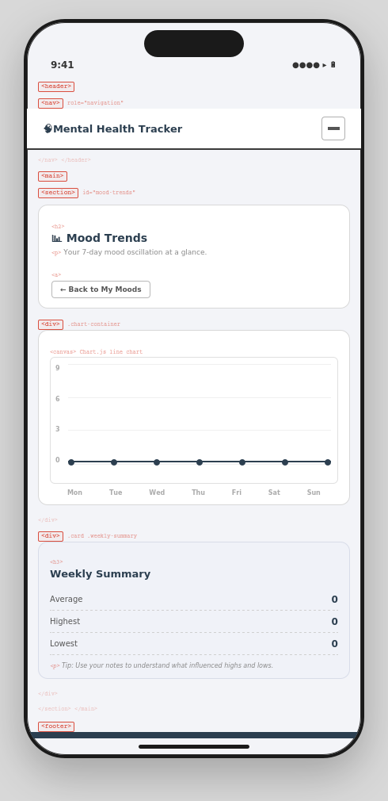 |
| Resources   | 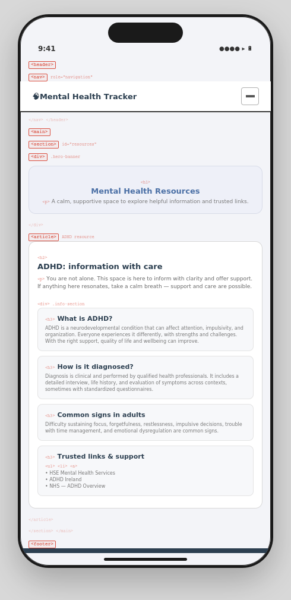     |

---

## Data Model

The application uses two custom models backed by PostgreSQL (production) or SQLite (development), plus Django's built-in `User` model.

### Entity Relationship Diagram

```
┌──────────────────┐       ┌──────────────────────┐
│   User (Django)  │       │     MoodEntry         │
├──────────────────┤       ├───────────────────────┤
│ id (PK)          │──┐    │ id (PK)               │
│ username         │  │    │ user (FK → User)      │
│ email            │  └───>│ date                  │
│ password         │       │ mood_score (0-10)     │
│                  │       │ notes (max 500 chars) │
│                  │       │ created_at            │
│                  │       │ updated_at            │
└──────────────────┘       └───────────────────────┘

┌───────────────────────┐
│     Resource           │
├───────────────────────-┤
│ id (PK)                │
│ title                  │
│ description            │
│ link (URL)             │
│ category (ADHD /       │
│   Depression /         │
│   Anxiety / General)   │
│ created_at             │
│ updated_at             │
└───────────────────────-┘
```

**Relationships:**

- Each `User` can have many `MoodEntry` records (one-to-many)
- `Resource` is a standalone model managed through the Django admin panel
- When a `User` is deleted, all associated `MoodEntry` records are also deleted (`CASCADE`)

---

## Features

### Home Page

- Welcome message explaining the app's purpose
- Three feature cards linking to mood tracking, daily journaling, and privacy info
- Responsive layout using Bootstrap 5 grid

### User Authentication

- Custom registration form with email, username, and password
- Django's built-in authentication for login/logout
- Success messages on registration, login, and logout
- `@login_required` decorator protects all mood and resource pages

### Mood Tracking (Full CRUD)

- **Create**: Log a mood score (0-10) using a colour-changing slider and optional notes with a character counter
- **Read**: View all past entries in a paginated list (10 per page)
- **Update**: Edit any of your own entries
- **Delete**: Remove entries with a confirmation page before deletion
- Users can only access their own entries — attempting to view, edit, or delete another user's entry returns a 404

### Mood Trends

- Weekly line chart built with Chart.js showing average daily mood scores
- Summary statistics: weekly average, highest score, lowest score
- Chart loads asynchronously from CDN and handles load failures gracefully

### Resource Library

- Curated links grouped into four categories: ADHD, Depression, Anxiety, General
- Resources are managed through the Django admin panel
- Each resource has a title, description, and external link

### Privacy Page

- Accessible to all visitors (no login required)
- Explains data handling and user rights

### Custom Error Pages

- Custom 404 page with navigation back to home
- Custom 500 page for server errors

### Responsive Design

- Fully responsive across mobile (375px), tablet (768px), and desktop (1200px+)
- Bootstrap 5 grid with collapsible navbar on smaller screens
- Hover effects on cards and buttons using vanilla JavaScript

---

## Future Features

- Monthly and yearly trend views (not just weekly)
- Export mood data as CSV
- Mood entry reminders via email
- Dark mode toggle
- Social sharing of mood streaks (opt-in)
- Admin dashboard with usage statistics

---

## Technologies Used

### Languages

- Python 3.14
- HTML5
- CSS3
- JavaScript (ES6)

### Frameworks and Libraries

- **Django 6.0.1** — web framework
- **Bootstrap 5** — responsive UI components
- **Chart.js** — mood trends line chart
- **Font Awesome 6.4.0** — icons
- **WhiteNoise** — static file serving in production
- **Gunicorn** — WSGI HTTP server for production
- **dj-database-url** — database configuration from environment variable
- **python-decouple** — environment variable management
- **Pillow** — image processing
- **psycopg2** — PostgreSQL adapter
- **coverage** — test coverage reporting

### Tools

- **Git** — version control
- **GitHub** — repository hosting and issue tracking
- **Heroku** — cloud deployment
- **JSHint** — JavaScript validation
- **W3C Markup Validator** — HTML validation
- **W3C CSS Validator** — CSS validation
- **Claude** — wireframe generation

---

## Testing

Full testing documentation is available in [docs/TESTING.md](docs/TESTING.md).

### Summary

- **46 automated Python tests** covering models, forms, views, and a full user-flow integration test
- **19 manual JavaScript tests** covering hover effects, slider behaviour, character counter, Chart.js rendering, and responsiveness
- **98% code coverage** across all Python files
- **Validation**: HTML (W3C), CSS (W3C), JavaScript (JSHint) — all passing

### Python Test Results (46 tests passing)

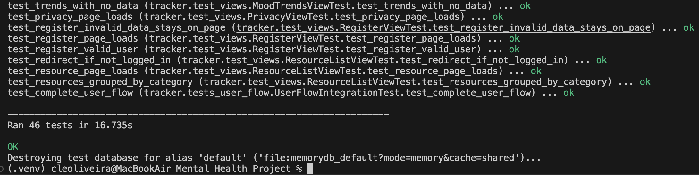

### Coverage Report (98%)

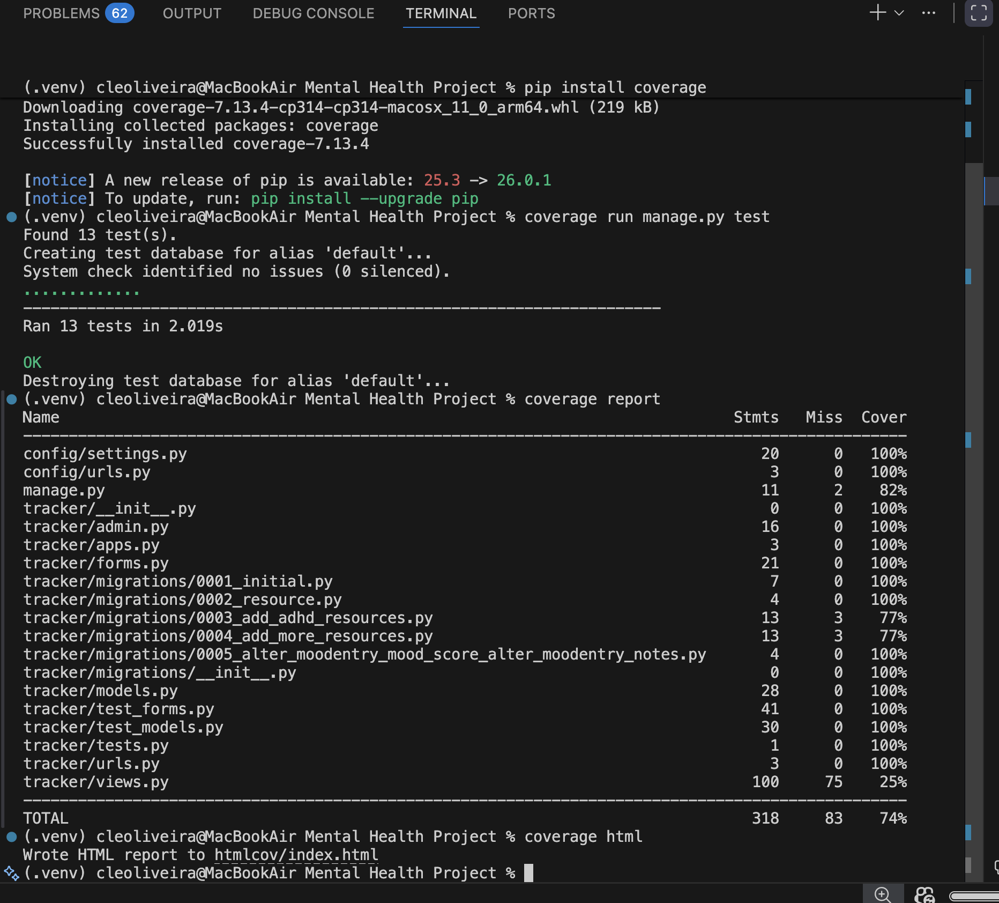

### JavaScript Validation (JSHint)

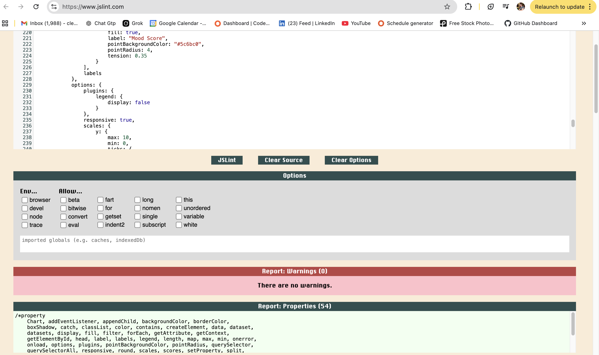

### CSS Validation (W3C)

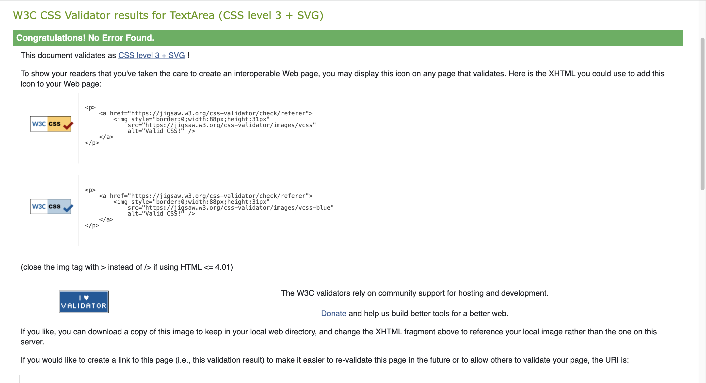

### HTML Validation (W3C)

All HTML pages passed W3C validation with no errors. Full screenshots available in [TESTING.md](docs/TESTING.md).

| Page                     | Result |
| ------------------------ | :----: |
| base.html                |  Pass  |
| home.html                |  Pass  |
| login.html               |  Pass  |
| register.html            |  Pass  |
| mood_form.html           |  Pass  |
| mood_list.html           |  Pass  |
| mood_confirm_delete.html |  Pass  |
| mood_trends.html         |  Pass  |
| resources_list.html      |  Pass  |

### Lighthouse Audit (Mobile)

| Category       | Score | Screenshot                                                                     |
| -------------- | :---: | ------------------------------------------------------------------------------ |
| Performance    |  92   | 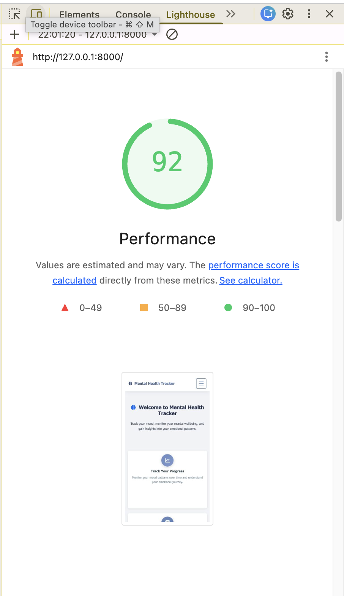       |
| Accessibility  |  94   | 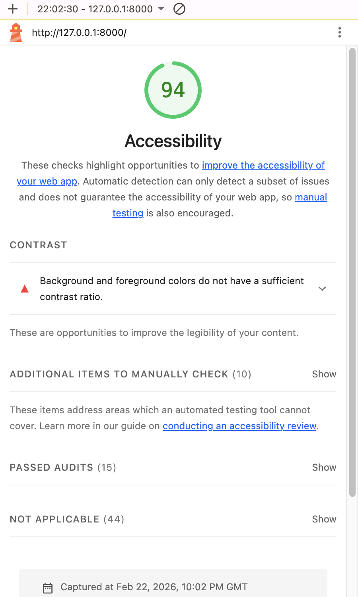   |
| Best Practices |  77   | 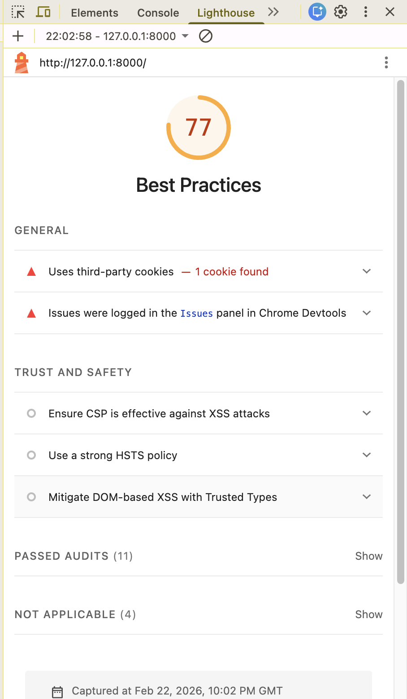 |
| SEO            |  90   | 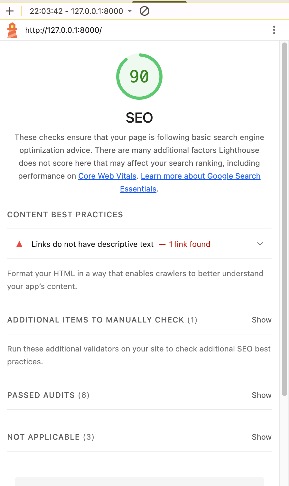                       |

### Lighthouse Audit (Desktop)

| Category       | Score | Screenshot                                                                       |
| -------------- | :---: | -------------------------------------------------------------------------------- |
| Performance    |  100  | 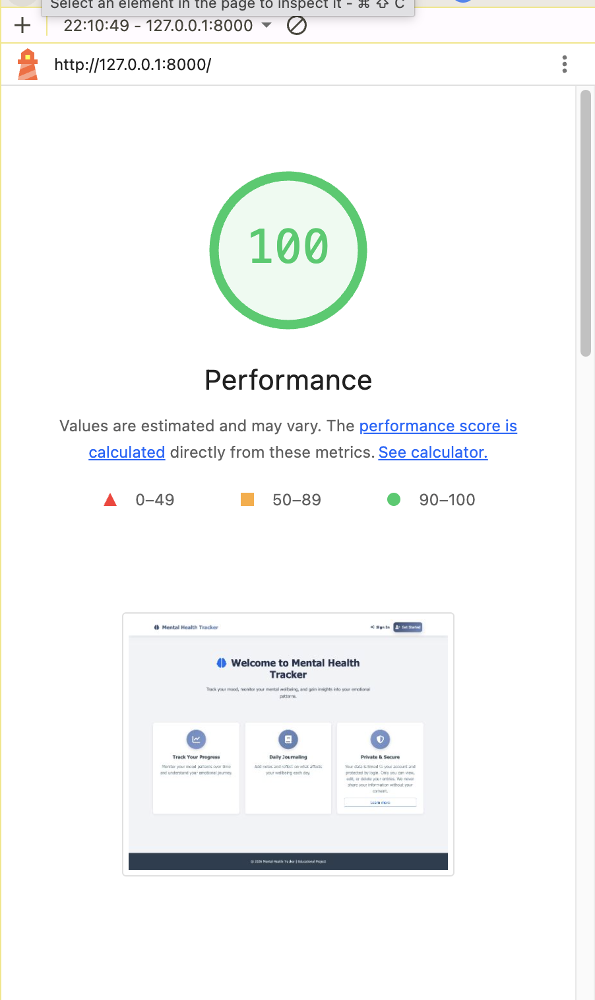       |
| Accessibility  |  94   | 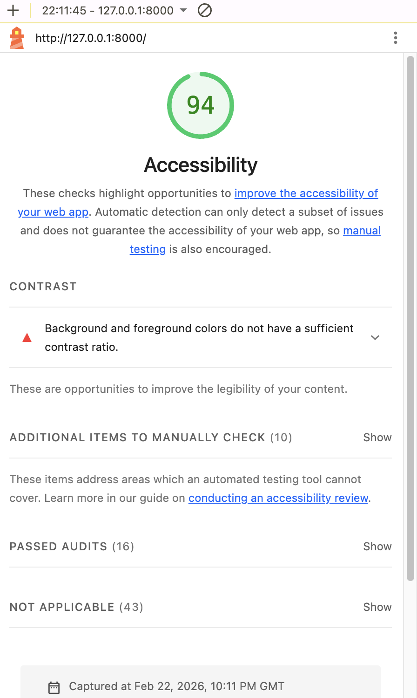   |
| Best Practices |  77   | 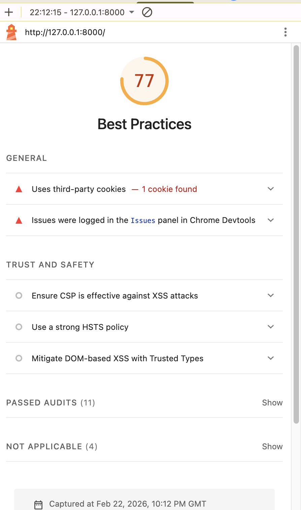 |
| SEO            |  90   | 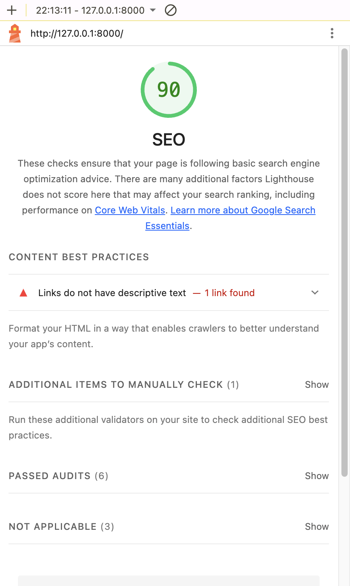                       |

### Test Files

| File                         | Tests | Coverage                                                 |
| ---------------------------- | :---: | -------------------------------------------------------- |
| `tracker/test_models.py`     |   5   | MoodEntry and Resource model behaviour                   |
| `tracker/test_forms.py`      |   8   | RegisterForm and MoodEntryForm validation                |
| `tracker/test_views.py`      |  32   | All views: auth, CRUD, permissions, pagination, 404s     |
| `tracker/tests_user_flow.py` |   1   | Full user journey: login → create → view → edit → delete |

### Running Tests

```bash
python manage.py test tracker -v 2
```

---

## Deployment

The application is deployed on **Heroku** using a PostgreSQL database.

### Prerequisites

- A [Heroku](https://heroku.com) account
- [Heroku CLI](https://devcenter.heroku.com/articles/heroku-cli) installed
- A GitHub repository with the project code

### Heroku Deployment Steps

1. **Create a Heroku app**

   ```bash
   heroku create your-app-name
   ```

2. **Add PostgreSQL**

   ```bash
   heroku addons:create heroku-postgresql:essential-0
   ```

3. **Set environment variables**

   ```bash
   heroku config:set SECRET_KEY="your-secret-key"
   heroku config:set DEBUG=False
   heroku config:set ALLOWED_HOSTS="your-app-name.herokuapp.com"
   ```

4. **Deploy**

   ```bash
   git push heroku main
   ```

5. **Run migrations**

   ```bash
   heroku run python manage.py migrate
   ```

6. **Create a superuser** (for admin panel access)
   ```bash
   heroku run python manage.py createsuperuser
   ```

### Local Development

To run this project locally:

1. Clone the repository:

   ```bash
   git clone https://github.com/oliveiracle/mental-health-tracker.git
   cd mental-health-tracker
   ```

2. Create and activate a virtual environment:

   ```bash
   python -m venv venv
   source venv/bin/activate  # On Windows: venv\Scripts\activate
   ```

3. Install dependencies:

   ```bash
   pip install -r requirements.txt
   ```

4. Create a `.env` file in the project root:

   ```
   SECRET_KEY=your-secret-key-here
   DEBUG=True
   ALLOWED_HOSTS=localhost,127.0.0.1
   ```

5. Run migrations and start the server:

   ```bash
   python manage.py migrate
   python manage.py runserver
   ```

6. Open `http://127.0.0.1:8000` in your browser.

---

## Security

The application follows security best practices:

- **Secret key** is stored in environment variables via `python-decouple`, never committed to version control
- **DEBUG mode** is disabled in production
- **CSRF protection** is enabled on all forms via Django's middleware
- **User isolation**: mood entries are filtered by `user=request.user` and protected with `get_object_or_404` — users cannot access, edit, or delete other users' data
- **Password validation** uses Django's built-in validators (minimum length, common password check, numeric check, similarity check)
- **HTTPS** is enforced by Heroku in production
- **WhiteNoise** serves static files securely without needing a separate file server
- **Sensitive files** (`.env`, `db.sqlite3`) are excluded from version control via `.gitignore`
- **Custom error pages** (404, 500) prevent information leakage from default Django error pages

---

## Credits

### Content

- Mental health resources were curated from publicly available sources including NHS, Mind, and ADHD Foundation
- Privacy policy text was written specifically for this project
- All text content was written by the developer

### Code

- Django authentication system based on [Django documentation](https://docs.djangoproject.com/en/6.0/topics/auth/)
- Chart.js implementation guided by [Chart.js documentation](https://www.chartjs.org/docs/)
- Bootstrap 5 components from [Bootstrap documentation](https://getbootstrap.com/docs/5.3/)
- Pagination pattern from [Django documentation on pagination](https://docs.djangoproject.com/en/6.0/topics/pagination/)

### Media

- Icons from [Font Awesome](https://fontawesome.com/) (free tier)
- No external images used — all visual elements are CSS/icon-based

### AI Tools

- GitHub Copilot (OpenAI/Microsoft) — Used for code suggestions, refactoring, and productivity improvements throughout the project. All code was reviewed and validated by the developer.
- Claude Code (Anthropic) — AI coding assistant used throughout development for debugging, writing and reviewing automated tests, improving code quality, and project consulting. All code was understood, reviewed, and verified by the developer.
- Claude (Anthropic) — Used to generate wireframe designs for both desktop and mobile layouts, and to create the colour palette image.

### Acknowledgements

- Code Institute for the project brief, learning materials, and assessment criteria
- The Django, Bootstrap, and Chart.js open-source communities
- Stack Overflow for troubleshooting specific Django issues during development
